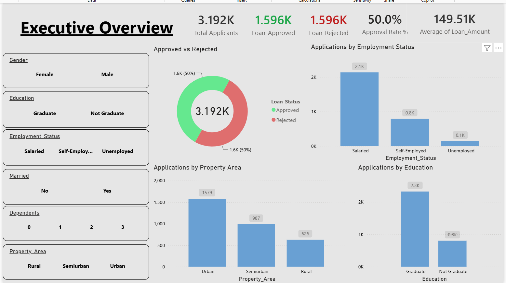
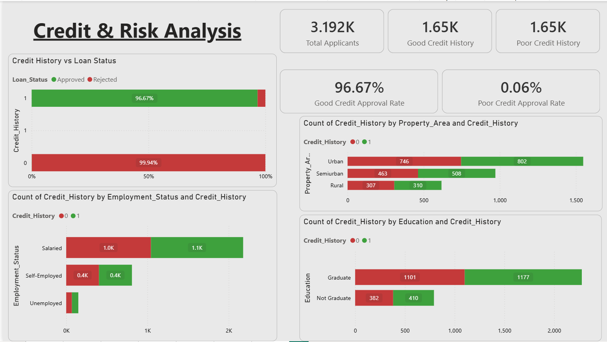
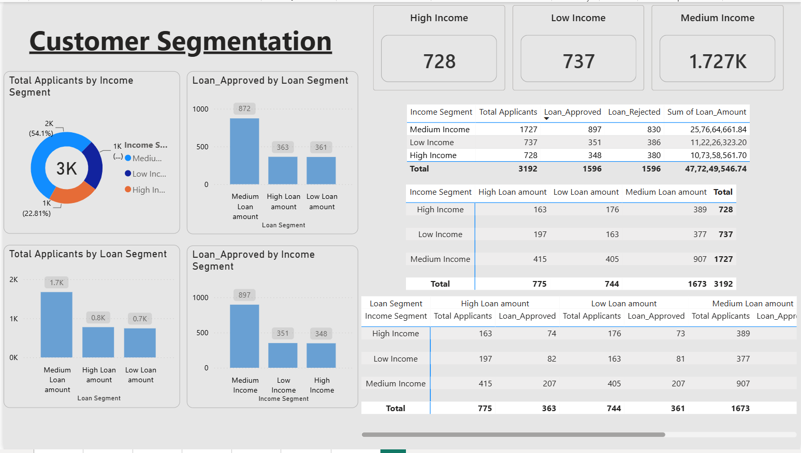
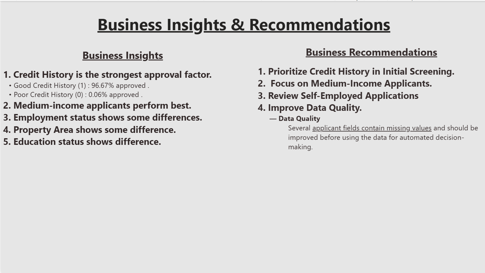

# Banking Customer & Loan Risk Analysis

## 📌 Project Overview

This project focuses on analyzing banking customer data and loan applications to understand customer characteristics, loan patterns, approval and rejection trends, and factors associated with loan risk.

The project combines **Python, SQL, and Power BI** to perform data analysis, identify important patterns, and generate actionable business insights for banking and lending decisions.

---

## 🎯 Objectives

- Analyze banking customer demographics and characteristics
- Understand loan application and approval patterns
- Analyze loan approval and rejection trends
- Identify factors associated with loan risk
- Analyze customer income and loan amount patterns
- Segment customers based on relevant characteristics
- Perform SQL-based customer and loan analysis
- Build an interactive Power BI dashboard
- Generate actionable business insights and recommendations

---

## 🛠️ Tools & Technologies

- **Python**
- **Pandas**
- **NumPy**
- **Matplotlib**
- **Seaborn**
- **SQL / MySQL**
- **Power BI**
- **Jupyter Notebook**
- **DAX**

---

## 🐍 Python Analysis

Python was used for data cleaning, exploratory data analysis, and visualization.

The analysis includes:

- Data loading and exploration
- Data quality checks
- Missing value analysis
- Data preprocessing
- Customer demographic analysis
- Income analysis
- Loan amount analysis
- Loan approval and rejection analysis
- Customer segmentation
- Risk pattern analysis
- Data visualization

---

## 🗄️ SQL Analysis

SQL was used to analyze customer and loan data and extract business insights.

The analysis includes:

- Customer distribution analysis
- Loan application analysis
- Approved vs rejected loan analysis
- Customer segmentation
- Income-based analysis
- Loan amount analysis
- Risk analysis
- Aggregation using `GROUP BY`
- Filtering using `WHERE` and `HAVING`
- Sorting and ranking
- Business-focused SQL queries

---

## 📊 Power BI Dashboard

An interactive Power BI dashboard was developed to provide a visual overview of banking customers and loan performance.

The dashboard focuses on:

- Total Customers
- Total Loan Applications
- Approved Loans
- Rejected Loans
- Approval Rate
- Rejection Rate
- Customer Segments
- Income Analysis
- Loan Amount Analysis
- Loan Risk Patterns
- Key Business Insights

---

## 🔍 Key Insights

The analysis helps identify:

- Customer characteristics associated with different loan outcomes
- Patterns in loan approvals and rejections
- Relationships between customer income and loan amounts
- Customer segments with different levels of loan risk
- Important factors that can support better lending decisions

---

## 💡 Business Recommendations

Based on the analysis, banking institutions can:

- Identify higher-risk customer segments for closer evaluation
- Use customer and loan characteristics to support credit assessment
- Improve loan approval processes using data-driven insights
- Monitor rejection patterns to identify potential process improvements
- Segment customers for more targeted lending strategies
- Use analytics dashboards for continuous monitoring of loan performance

---

## 📸 Dashboard Preview

------

## 📂 Dataset

The dataset contains banking customer and loan-related information used to analyze customer characteristics, loan applications, approval outcomes, and risk patterns.

## ▶️ How to Run the Project

### Python
1. Clone or download this repository.
2. Open the Jupyter Notebook:
3. Python/Banking_Customer_Loan_Risk_Analysis.ipynb
4. Make sure the dataset is available in the Data folder.
5. Run the notebook cells sequentially.

### SQL
1. Open MySQL Workbench.
2. Create or select the required database.
3. Load the dataset.
4. Open:
5. SQL/Banking_Customer_Loan_Risk_Analysis.sql
6. Execute the queries to reproduce the analysis.
   
### Power BI
1. Open Power BI Desktop.
2. Open:
3. PowerBI/Banking_Customer_Loan_Risk_Dashboard.pbix
4. If required, update the dataset/file path.
5. Refresh the data to view the dashboard.

-----

## 🧠 Skills Demonstrated
- Data Cleaning
- Exploratory Data Analysis
- Data Visualization
- Python Data Analysis
- SQL Analysis
- Customer Segmentation
- Loan Analysis
- Risk Analysis
- Power BI Dashboard Development
- DAX
- Business Intelligence
- Business Insights
- Data-Driven Decision Making

-----

## 👤 Author

**Sagar Deekonda**
